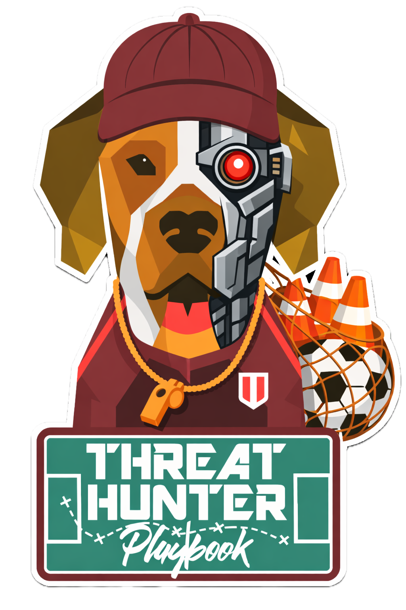

# The Threat Hunter Playbook

The Threat Hunter Playbook is a community-driven, open source project focused on **documenting how threat hunters think, plan, and reason** before, during, and after a hunt. The project captures adversary tradecraft, detection logic, and supporting resources in a structured way to make threat hunting more effective and repeatable. All hunt documents follow the structure of [MITRE ATT&CK](https://attack.mitre.org/), organizing post-compromise behavior into tactical groups and expressing it through [interactive Jupyter notebooks](https://docs.jupyter.org/en/latest/projects/architecture/content-architecture.html#the-jupyter-notebook-format). These notebooks combine markdown, analytics, datasets, and validation queries, allowing hunts to be treated as executable documents that preserve intent and reasoning—not just results—and can be run locally or remotely using [pre-recorded security datasets](https://securitydatasets.com) and [BinderHub](https://mybinder.readthedocs.io/en/latest/index.html).

> With recent advances in Generative AI, the project has entered a transformation phase focused on augmenting threat hunting workflows across planning, execution, and reporting. Rather than replacing existing practices, the goal is to integrate AI in a way that reinforces structure and intent throughout the lifecycle. As a first step, the project incorporates solutions such as [Agent Skills](https://agentskills.io/home) to capture hunting knowledge as explicit workflows, providing clear guidance, templates, and references. [Agent Skills](https://agentskills.io/home) guide reasoning and decision making, refining broad inputs into structured, testable hunt artifacts and laying the groundwork for deeper AI augmentation over time.

## Docs: https://threathunterplaybook.com/

## Goals

* Document and share how threat hunters plan, reason, and structure hunts across the full lifecycle.
* Expedite the development of hunt techniques and hypotheses grounded in system behavior and adversary tradecraft.
* Provide reusable workflows, templates, and references that support consistent hunt planning and analysis.
* Enable validation and experimentation using pre-recorded security datasets, locally or through cloud-based environments.
* Enable AI-augmented threat hunting workflows with human oversight.
* Accelerate learning and knowledge sharing through open source, community-driven resources.

## Threat Hunting as a Framework

The Threat Hunter Playbook is organized around a simple, repeatable lifecycle grounded in shared understanding of system behavior, adversary tradecraft, and environmental context. The framework captures how hunts are planned, executed, and documented, emphasizing structure and reasoning over ad hoc investigation.

At a high level, the framework consists of three stages:

- **Plan** — Build context and analytic intent by defining the behavior being hunted,
  assumptions, expected activity, and how that behavior should manifest in telemetry.
- **Execute** — Apply the plan by running queries, analyzing results, and iterating as
  assumptions are tested and new context emerges.
- **Report** — Capture outcomes regardless of results, including findings, false
  positives, visibility gaps, and follow-on actions.

> While the framework spans the full hunting lifecycle, the work in this repository currently concentrates on **formalizing the planning stage**, where intent, assumptions, and analytic structure are established before execution begins.

## Agent Skills for Threat Hunting

To support this evolution, the project introduces [Agent Skills](https://agentskills.io/home) as a way to express threat hunting workflows in a form that both humans and AI agents can follow consistently. Agent Skills package knowledge as explicit workflows with ordered steps,  templates, and references, allowing agents to apply structure where it is most valuable.

In this project, Agent Skills are used to generate a structured hunt blueprint through workflows such as:

- Researching system internals and adversary tradecraft  
- Defining a focused hunt hypothesis  
- Identifying relevant data sources  
- Developing analytics that model adversary behavior  
- Assembling a complete hunt blueprint for execution  

For a detailed walkthrough and example of these workflows in action, see the accompanying blog post.

## Authors

* Roberto Rodriguez [@Cyb3rWard0g](https://twitter.com/Cyb3rWard0g)
* Jose Luis Rodriguez [@Cyb3rPandaH](https://twitter.com/Cyb3rPandaH)

## Acknowledgements

* We document and share our content via a [Jupyter Book](https://jupyterbook.org/intro.html) which was created by [Sam Lau](http://www.samlau.me/) and [Chris Holdgraf](https://predictablynoisy.com/) with support of the **UC Berkeley Data Science Education Program and the [Berkeley Institute for Data Science](https://bids.berkeley.edu/)**
