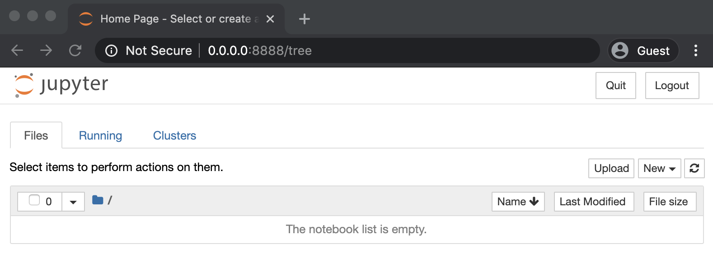

---
jupyter:
  jupytext:
    formats: md:myst
    text_representation:
      extension: .md
      format_name: myst
      format_version: '1.3'
      jupytext_version: 1.14.1
  kernelspec:
    display_name: Python
    language: python
    name: python3
---

# Jupyter Server Installation

I am sure you are anxious to install Jupyter and start exploring its capabilities, but first you have to decide if you want to install the Jupyter Notebook server directly on your system or host it on a virtual machine or a docker container.
I believe it is important to give you the options so that you feel comfortable running the tool however you feel like it. If you want to do a classic install directly on your system, follow the [official Jupyter Install documents](https://jupyter.org/install).

## Docker

I prefer to share a standardized and working environment via docker images to focus more on the capabilities of the application rather than spend time troubleshooting the server installation.

### Pre-Requirements

* [Docker Community Edition](https://docs.docker.com/install/linux/docker-ce/binaries/)
* [Docker Compose](https://docs.docker.com/compose/install/)

### Clone Notebooks Forge

```bash
git clone https://github.com/OTRF/notebooks-forge
```

### Build & Run Docker Image

```bash
cd notebooks-forge/blob/master/docker/jupyter-base
docker-compose -f docker-compose.yml up --build -d

```

### Get Notebook Server Link

```bash
docker exec -i jupyter-base jupyter notebook list
```

### Browse to Link



### Demo Video

<iframe width="560" height="315" src="https://www.youtube.com/embed/KVR1_cVlLRE" frameborder="0" allow="accelerometer; autoplay; encrypted-media; gyroscope; picture-in-picture" allowfullscreen></iframe>

## BinderHub

Another way to interact with a Jupyter Notebook server is by leveraging the BinderHub public computing infrastructure and a Binder Repository (i.e A Dockerfile). If you want to learn more about this, you can read the [MyBinder](https://mybinder.readthedocs.io/en/latest/index.html) and [BinderHub](https://binderhub.readthedocs.io/en/latest/overview.html) docs.

For this tutorial, I will be using BinderHub to deploy a Jupyter notebook server and host all the material that I would like you to go over to learn a little bit more about Jupyter notebooks. Therefore, all you have to do is click on the following Badge:

* [](https://mybinder.org/v2/gh/OTRF/infosec-jupyter-book/master)

Right after that you will see the following Binder page preparing and launching the Jupyter Notebook server:


Next, you can browse to the following path `docs/tutorials` and you will find the folder for this tutorial


That's it! Now you are ready to start going through the whole Jupyter Notebooks Tutorial! One thing to mention before going to the next section is that this Jupyter Book has all the notebooks as HTML views and you can interact with the notebooks backing up the page by clicking on the `Interact` button on the top of each notebook. That is the easiest way to open notebooks in BinderHub directly for this tutorial!
