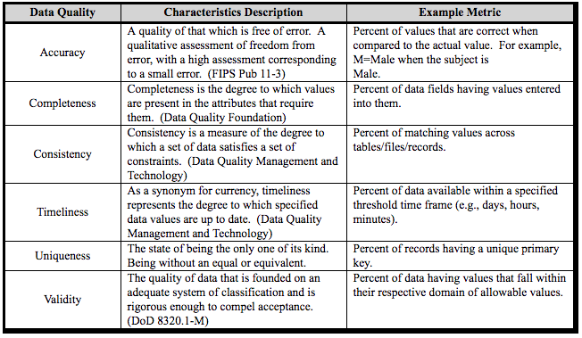

# Pre-Hunt Activities

There are a few processes that need to happen before the execution of a hunt.

## Data Governance

Data Governance is a collection of practices and processes which help to ensure the formal management of data assets within an organization. This concept must be implemented before performing a hunting engagement and also during the research stage.

### Data Documentation

Documenting event logs is one of the main ways that a hunter will be able to understand exactly what it is that is being collected. This is one of the first steps to start building a data wiki. A lot of organizations do not take this concept seriously and end up collecting as much as they can without considering the level of understanding or knowledge of the logs in order to develop data analytics.

In this activity, hunters will have to build data dictionaries for each event log being collected in their environment. A Data Dictionary is a collection of names, definitions, and attributes about data elements that are being used or captured in a database, information system, or part of a research project.

### Data Standardization

The data standardization process relies heavily on the use of a Common Information Model (CIM) in order to facilitate the normalization of data sets via a standard way to parse data. A common schema helps hunters to correlate data from diverse data sources, and avoid writing long queries trying to hit every possible name assigned to a field that provides the same information across several data sources.

Understanding the standardization of events and their respective field names help hunters tremendously when developing data analytics.

### Data Modeling

A data model basically determines the structure of data and the relationships identified among each other. Identifying relationships among security events is very important to document specific events that could map to specific chain of events related to adversaries behaviors. Mitre ATT&CK created its [own data model](https://car.mitre.org/data_model/) strongly inspired by [STIX Cyber Obserbale Objects](http://docs.oasis-open.org/cti/stix/v2.0/stix-v2.0-part4-cyber-observable-objects.html).

For example, we can model Sysmon events and find that almost all its events can be correlated by the `ProcessGUID` field. If we visualize those relationships, we get the following image:

We can then use that model and start mapping events to adversarial activity. For example, we can map Windows Management Instrumentation (WMI) spawning a new process that makes a network connection to communicate with an external network entity to specific Sysmon event logs joined by their `ProcessGUID` value.

Once again, documenting event logs structure and identifying relationships among them is a very important exercise before writing queries. It helps hunters to find potential correlations that you might have not been aware before. Hunters can also benefit from the extra context identified during this exercise and develop more robust data analytics.

### Data Quality
 
One definition used the most about data quality is from Joseph M. Juran, author of [Juran’s Quality Handbook](https://www.amazon.com/Jurans-Quality-Handbook-Joseph-Juran/dp/007034003X/ref=pd_lpo_sbs_14_img_2?_encoding=UTF8&psc=1&refRID=GD9GCVSAQAHY7AC6XGC8), who quoted, in page 998,
> Data are of high quality if they are fit for their intended uses in operations, decision making and planning.

In other words, if data needed for a hunting engagement does not meet specific requirements defined by the hunt team, then the data is not considered quality data since it is affecting the intended purpose of it. I liked how Stephanie Zatyko from [“Experian Data Quality”](https://www.edq.com/blog/data-quality-vs-data-governance/) defined it by saying that if data was water, data quality ensures water is clean and does not get contaminated.

This activity is one of the most important ones, and it could actually define the success of your hunting engagement before it event starts. This is because if you identify that the data you will be using for your hunt is not of quality, then you you will anticipate obstacles validating the detection of adversarial techniques. Several teams ignore this activity and spend weeks trying to figure out why their query would not return any results. Others assume that their environment might not be compromised because their query did not return anything when in reality, they are not even collecting the right data in the first place.

Data Quality Goals:

* Reduce the time hunters spend fixing and validating data issues increasing productivity during hunting engagements.
* Improve consistency across data sources to manipulate data more efficiently allowing more complex analytics that rely on several resources for extra context.
* Enhance automation flow

Data Quality Dimensions:

Used to simplify the representation of measurable characteristics of data quality. There are several data quality dimensions defined out there that are useful, depending on the intended use of the data. However, for data that I need for a hunt program, I like to reference a few data quality dimensions from the ["DoD Core Set Of Data Quality Requirements"](https://medium.com/r/?url=http%3A%2F%2Fmitiq.mit.edu%2FICIQ%2FDocuments%2FIQ%2520Conference%25201996%2FPapers%2FDODGuidelinesonDataQualityManagement.pdf) A few of those Data Quality (DQ) dimensions could help your team categorize gaps found in data intended to be used for hunting purposes.

Some of the DQ dimensions above might be hard to assess. Therefore, I recommend to at least cover **Completeness**, **Consistency** and **Timeliness**. Those will help you to start the conversation about your data with teams in charge of maintaining the data you use for hunting engagements.

# References

* http://www.dataversity.net/what-is-data-governance/
* http://library.ucmerced.edu/node/10249
* http://docs.oasis-open.org/cti/stix/v2.0/stix-v2.0-part4-cyber-observable-objects.html